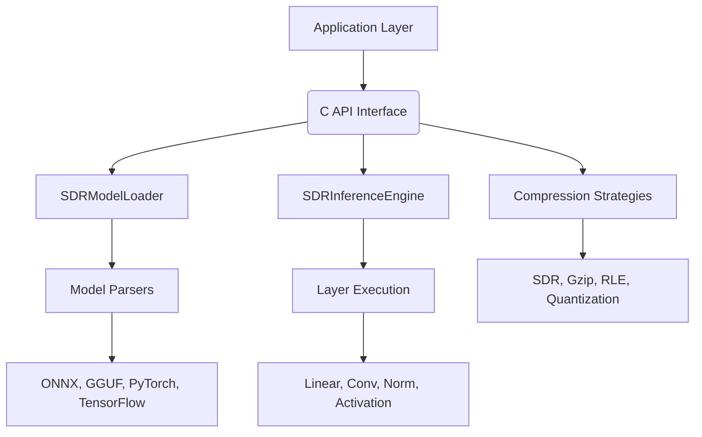
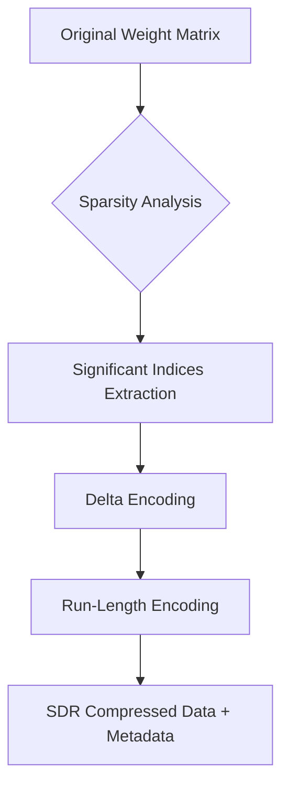
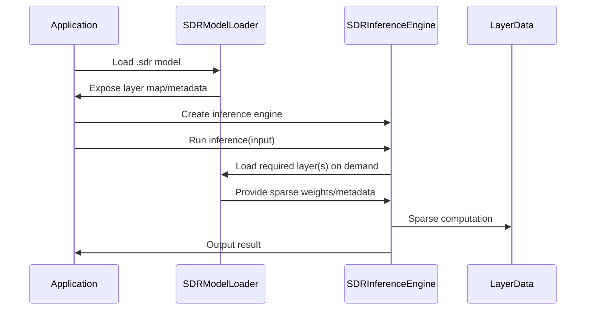

# CortexSDR AI Compression & Inference SDK
## Developer Guide & Integration Manual

---

## Table of Contents
1. [Introduction & Design Philosophy](#introduction--design-philosophy)
2. [Architecture Overview](#architecture-overview)
3. [Understanding SDR Compression](#understanding-sdr-compression)
4. [Getting Started](#getting-started)
5. [Model Compression Workflow](#model-compression-workflow)
6. [Inference Engine Deep Dive](#inference-engine-deep-dive)
7. [Integration Patterns](#integration-patterns)
8. [Advanced Usage](#advanced-usage)
9. [Troubleshooting & Best Practices](#troubleshooting--best-practices)

---

## Introduction & Design Philosophy

CortexSDR is a specialized AI model compression and inference engine designed around **Sparse Distributed Representation (SDR)** principles. Unlike traditional compression libraries that focus solely on reducing file size, CortexSDR optimizes for **inference efficiency** and **memory usage** while maintaining model accuracy. The SDK is designed to be modular, cross-platform, and easy to integrate into a wide range of applications, from mobile and IoT to cloud and automotive systems.

### The .sdr Model Format

Models compressed with CortexSDR use the `.sdr` extension, which represents a specialized archive format containing:
- **SDR-compressed weight tensors** (typically 10-50x smaller than original)
- **Layer metadata** (shapes, types, connections)
- **Model configuration** (architecture, hyperparameters)
- **Optimized inference graph** (for efficient execution)

### Why SDR Compression?

**Traditional compression** (like Gzip) treats model weights as generic binary data, achieving 2-3x compression but requiring full decompression before inference.

**SDR compression** leverages the inherent sparsity and structure of neural network weights:
- Only stores the **most significant weight indices** (typically 1-5% of weights)
- Preserves **spatial relationships** between weights
- Enables **sparse inference** without full decompression
- Results in **10-50x compression ratios** for most models

### Design Principles

1. **Memory Efficiency**: Load only what you need, when you need it
2. **Inference Speed**: Optimize for forward pass, not just compression
3. **Accuracy Preservation**: Maintain model performance within 1-2% of original
4. **Cross-Platform**: Single codebase for mobile, edge, cloud, and embedded

---

## Architecture Overview

The CortexSDR SDK is organized into several core components, each responsible for a specific part of the compression and inference pipeline. The following diagram illustrates the high-level architecture:



**Explanation:**
- The **Application Layer** is your code (mobile app, cloud service, IoT firmware, etc.) that interacts with the SDK via the C API.
- The **C API Interface** provides a stable, cross-platform boundary for integration.
- **SDRModelLoader** is responsible for loading and parsing compressed `.sdr` models, exposing layer metadata and data.
- **SDRInferenceEngine** executes inference using sparse, memory-efficient computation, loading only the required layers on demand.
- **Compression Strategies** (SDR, Gzip, RLE, Quantization) are pluggable modules that determine how each segment of the model is compressed.
- **Model Parsers** support multiple input formats, making it easy to bring models from popular frameworks.
- **Layer Execution** and **Layer Types** allow for flexible, extensible inference pipelines.

---

## Understanding SDR Compression

SDR (Sparse Distributed Representation) compression is at the heart of CortexSDR. It leverages the fact that most neural network weights are close to zero and only a small fraction are significant. By storing only the important weights and their positions, SDR achieves high compression ratios and enables direct sparse inference.

### SDR Compression Process

The following diagram illustrates the SDR compression pipeline, from dense weights to a compact, metadata-rich representation:



**Explanation:**
- The original dense weight matrix is analyzed for sparsity.
- Only significant (non-negligible) weights are kept, and their indices are extracted.
- Delta encoding and run-length encoding further compress the index data.
- The result is a compact SDR representation, stored with metadata for later reconstruction.

### .sdr File Structure

The `.sdr` file is a self-contained archive. The diagram below shows its internal structure:

```mermaid
flowchart TD
    A[.sdr File]
    A --> B1[Header & Index]
    A --> B2[Compressed Layer Segments]
    B2 --> C1[Weights (SDR, Quantized, etc.)]
    B2 --> C2[Layer Metadata]
    B2 --> C3[Model Config]
    B2 --> C4[Tokenizer/Vocab]
```

**Explanation:**
- The header and index allow fast lookup of layers and metadata.
- Each segment contains compressed weights, metadata, and configuration for a specific layer or model component.
- The format is extensible for future features (e.g., quantization, new layer types).

---

## Getting Started

To use CortexSDR, you typically start with a trained model in ONNX, PyTorch, or TensorFlow format. You then compress it into the `.sdr` format using the SDK tools or API, and deploy the compressed model to your target device or service.

**Installation:**

```bash
# Download pre-compiled library
wget https://github.com/cortexsdr/releases/latest/download/cortexsdr-linux-x64.tar.gz
tar -xzf cortexsdr-linux-x64.tar.gz
sudo cp -r cortexsdr /usr/local/

# Set environment variables
export LD_LIBRARY_PATH=/usr/local/cortexsdr/lib:$LD_LIBRARY_PATH
export CORTEXSDR_ROOT=/usr/local/cortexsdr
```

Before running inference, you must load the model and prepare your input. Here's how you do it:

```cpp
// Load the compressed model
CortexAICompression::SDRModelLoader loader("model.sdr");

// Create the inference engine
CortexAICompression::SDRInferenceEngine engine(loader);

// Prepare your input tensor (e.g., from sensor data or user input)
std::vector<float> input = {0.1f, 0.2f, 0.3f, /* ... */};

// Run inference
std::vector<float> output = engine.run(input);

std::cout << "Inference completed. Output size: " << output.size() << std::endl;
```

**Explanation:**
- The loader reads the `.sdr` file and exposes the model structure.
- The engine is initialized with the loader, ready for efficient inference.
- You provide your input tensor, and the engine returns the output after running the model.

### Understanding the Model Structure

When you load a `.sdr` model, you get access to:

```cpp
// Get model overview
const auto& layer_map = loader.getLayerMap();
std::cout << "Model contains " << layer_map.size() << " layers" << std::endl;

// Examine layer information
for (const auto& [name, layer] : layer_map) {
    std::cout << "Layer: " << name << std::endl;
    std::cout << "  Type: " << layer.layer_type << std::endl;
    std::cout << "  Input shape: [";
    for (size_t dim : layer.input_shape) {
        std::cout << dim << ", ";
    }
    std::cout << "]" << std::endl;
    std::cout << "  Active indices: " << layer.active_indices.size() << std::endl;
    std::cout << "  Raw data size: " << layer.raw_data.size() << " bytes" << std::endl;
}
```

---

## Model Compression Workflow

CortexSDR provides a flexible workflow for compressing models. You can tune the compression parameters to balance size, speed, and accuracy.

**Step 1: Prepare Your Model**

Start with a model in ONNX, PyTorch, or TensorFlow format. Convert to ONNX if needed.

**Step 2: Configure Compression**

You can select the compression strategy and sparsity level. For example, using SDR with 2% sparsity:

```cpp
#include "cortexsdr/core/AICompressor.hpp"
#include "cortexsdr/strategies/SDRIndexStorage.hpp"

auto parser = std::make_unique<ONNXModelParser>();
AICompressor compressor(std::move(parser));
auto sdr_strategy = std::make_shared<SDRIndexStorageStrategy>(0.02f);
compressor.registerStrategy(SegmentType::WEIGHTS_FP32, 1, 0x88, sdr_strategy);
```

**Explanation:**
- The parser loads your model and splits it into segments.
- The SDR strategy is registered for floating-point weights, with a sparsity of 2%.

**Step 3: Compress the Model**

```cpp
std::ofstream output("model.sdr", std::ios::binary);
compressor.compressModel("model.onnx", output);
```

**Step 4: Validate and Inspect**

After compression, you can inspect the model structure and compression statistics:

```cpp
const auto& stats = compressor.getCompressionStats();
std::cout << "Original size: " << stats.originalSize << " bytes\n";
std::cout << "Compressed size: " << stats.compressedSize << " bytes\n";
std::cout << "Compression ratio: " << stats.compressionRatio << "x\n";
```

**Explanatory Note:**
- The `.sdr` file now contains all the information needed for efficient inference, including compressed weights and metadata.

---

## Inference Engine Deep Dive

The inference engine is designed for memory efficiency and speed. It loads only the required layers on demand, and operates directly on the sparse representation.

### Inference Workflow

The following sequence diagram shows how inference is performed using the CortexSDR SDK:



**Explanation:**
- The application loads the `.sdr` model and creates an inference engine.
- When inference is requested, only the necessary layers are loaded into memory.
- The engine performs sparse computation, using only the significant weights.
- The result is returned to the application, with minimal memory and compute overhead.

### Layer-by-Layer Inference

For debugging or custom inference pipelines, you can run the model one layer at a time:

```cpp
SDRInferenceEngine engine(loader);
std::vector<std::string> layer_sequence = {"embedding", "attention_1", "ffn_1", "output"};
std::vector<float> input = getInputData();
std::vector<float> current = input;
for (const auto& layer_name : layer_sequence) {
    auto layer = loader.loadLayerByName(layer_name);
    current = engine.runLayer(layer, current);
}
```

**Explanation:**
- This approach is useful for debugging, custom inference flows, or partial model execution.
- The engine ensures that only the necessary data is loaded and processed at each step.

### Memory-Efficient Loading

The SDR inference engine uses **on-demand loading** to minimize memory usage:

```cpp
SDRModelLoader loader("large_model.sdr");

// Option 1: Load all layers (uses more memory)
const auto& all_layers = loader.getLayers();

// Option 2: Load layers on-demand (recommended for large models)
const auto& layer_map = loader.getLayerMap();
auto layer = loader.loadLayerByName("attention_layer_5");

// Option 3: Async loading for better performance
auto future_layer = loader.loadLayerByNameAsync("attention_layer_6");
// Do other work while layer loads...
auto layer = future_layer.get();
```

### Layer-by-Layer Inference

For debugging or custom inference pipelines:

```cpp
SDRInferenceEngine engine(loader);

// Run specific layers
std::vector<std::string> layer_sequence = {
    "embedding_layer",
    "attention_layer_1", 
    "attention_layer_2",
    "feed_forward_layer_1",
    "output_layer"
};

std::vector<float> input = getInputData();
std::vector<float> current = input;

for (const auto& layer_name : layer_sequence) {
    std::cout << "Processing layer: " << layer_name << std::endl;
    
    // Load layer on-demand
    auto layer = loader.loadLayerByName(layer_name);
    
    // Run single layer
    current = engine.runLayer(layer, current);
    
    std::cout << "Output shape: [" << layer.output_shape[0] 
              << ", " << layer.output_shape[1] << "]" << std::endl;
}
```

### Understanding Layer Types

Different layer types are handled differently:

```cpp
// Linear/Feed-forward layers
if (layer.isLinear()) {
    // Matrix multiplication: output = input * weights^T + bias
    // Weights are stored as sparse indices
    // Only non-zero weights participate in computation
}

// Convolutional layers  
if (layer.isConvolutional()) {
    // Convolution with sparse kernels
    // Kernel weights stored as sparse indices
    // Spatial relationships preserved
}

// Batch normalization layers
if (layer.isBatchNorm()) {
    // Apply learned normalization parameters
    // Running statistics updated during training
}

// Activation layers
if (layer.isActivation()) {
    // Apply activation function (ReLU, GELU, etc.)
    // No weights, just function application
}
```

### Custom Inference Pipelines

For specialized applications, you can build custom inference pipelines:

```cpp
class CustomInferencePipeline {
private:
    SDRModelLoader& loader_;
    SDRInferenceEngine& engine_;
    
public:
    std::vector<float> runCustomPipeline(const std::vector<float>& input) {
        // Step 1: Embedding lookup
        auto embedding_layer = loader_.loadLayerByName("embedding");
        auto embedded = engine_.runLayer(embedding_layer, input);
        
        // Step 2: Multi-head attention (custom implementation)
        auto attention_output = runMultiHeadAttention(embedded);
        
        // Step 3: Feed-forward with residual connection
        auto ff_layer = loader_.loadLayerByName("feed_forward");
        auto ff_output = engine_.runLayer(ff_layer, attention_output);
        auto residual = addTensors(attention_output, ff_output);
        
        // Step 4: Layer normalization
        auto ln_layer = loader_.loadLayerByName("layer_norm");
        auto normalized = engine_.runLayer(ln_layer, residual);
        
        return normalized;
    }
    
private:
    std::vector<float> runMultiHeadAttention(const std::vector<float>& input) {
        // Custom attention implementation
        // Load query, key, value projection layers
        auto q_layer = loader_.loadLayerByName("attention.q_proj");
        auto k_layer = loader_.loadLayerByName("attention.k_proj");
        auto v_layer = loader_.loadLayerByName("attention.v_proj");
        
        auto queries = engine_.runLayer(q_layer, input);
        auto keys = engine_.runLayer(k_layer, input);
        auto values = engine_.runLayer(v_layer, input);
        
        // Compute attention scores and apply
        return computeAttention(queries, keys, values);
    }
};
```

---

## Integration Patterns

CortexSDR is designed to be integrated into a wide range of environments. Here are some common patterns:

### Mobile Apps
- Use the C API to load `.sdr` models and run inference in native code (Objective-C/Swift for iOS, JNI for Android).
- The memory-efficient design is ideal for devices with limited RAM.

### Cloud Services
- Compress models in the cloud and serve `.sdr` files to edge devices.
- Run inference in scalable microservices using the C++ or C API.

### IoT & Embedded
- Deploy compressed models to devices with very limited storage and memory.
- Use on-demand loading to keep memory usage low.

**Explanatory Note:**
- The SDK is modular and can be compiled for different targets, making it suitable for everything from smartphones to microcontrollers.

---

## Advanced Usage

CortexSDR supports custom compression strategies, quantization, and model optimization. You can extend the SDK to fit your needs.

**Custom Compression Example:**

```cpp
class MyCustomStrategy : public ICompressionStrategy {
    // Implement compress() and decompress() for your use case
};
```

**Explanatory Note:**
- Advanced users can implement their own strategies for research or specialized deployment scenarios.

### Model Optimization

Optimize models for specific deployment scenarios:

```cpp
class ModelOptimizer {
public:
    struct OptimizationConfig {
        float target_sparsity = 0.02f;
        bool enable_quantization = true;
        int quantization_bits = 8;
        bool enable_pruning = false;
        float pruning_threshold = 0.001f;
    };
    
    static void optimizeModel(const std::string& input_path, 
                            const std::string& output_path,
                            const OptimizationConfig& config) {
        
        // Load original model
        auto parser = std::make_unique<ONNXModelParser>();
        auto segments = parser->parse(input_path);
        
        // Apply optimizations
        for (auto& segment : segments) {
            if (segment.isWeightTensor()) {
                // Apply sparsity optimization
                if (config.enable_pruning) {
                    segment = applyPruning(segment, config.pruning_threshold);
                }
                
                // Apply quantization
                if (config.enable_quantization) {
                    segment = applyQuantization(segment, config.quantization_bits);
                }
            }
        }
        
        // Compress optimized model
        AICompressor compressor(std::move(parser));
        
        auto sdr_strategy = std::make_shared<SDRIndexStorageStrategy>(config.target_sparsity);
        compressor.registerStrategy(SegmentType::WEIGHTS_FP32, 1, 0x88, sdr_strategy);
        
        std::ofstream output(output_path, std::ios::binary);
        compressor.compressModel(input_path, output);
    }
    
private:
    static ModelSegment applyPruning(const ModelSegment& segment, float threshold) {
        // Implement weight pruning logic
        // Remove weights below threshold
        return segment;
    }
    
    static ModelSegment applyQuantization(const ModelSegment& segment, int bits) {
        // Implement quantization logic
        // Convert float weights to lower precision
        return segment;
    }
};
```

### Performance Profiling

Monitor and optimize inference performance:

```cpp
class InferenceProfiler {
private:
    SDRInferenceEngine& engine_;
    std::unordered_map<std::string, std::vector<double>> layer_times_;
    
public:
    InferenceProfiler(SDRInferenceEngine& engine) : engine_(engine) {}
    
    std::vector<float> runWithProfiling(const std::vector<float>& input) {
        auto start_time = std::chrono::high_resolution_clock::now();
        
        // Run inference with layer-by-layer timing
        std::vector<float> result = runInferenceWithTiming(input);
        
        auto end_time = std::chrono::high_resolution_clock::now();
        auto total_time = std::chrono::duration<double, std::milliseconds>(
            end_time - start_time).count();
        
        // Print profiling results
        printProfilingResults(total_time);
        
        return result;
    }
    
    void printProfilingResults(double total_time) {
        std::cout << "\n=== Inference Profiling Results ===" << std::endl;
        std::cout << "Total inference time: " << total_time << " ms" << std::endl;
        std::cout << "\nLayer breakdown:" << std::endl;
        
        for (const auto& [layer_name, times] : layer_times_) {
            double avg_time = std::accumulate(times.begin(), times.end(), 0.0) / times.size();
            double percentage = (avg_time / total_time) * 100.0;
            
            std::cout << "  " << layer_name << ": " 
                      << std::fixed << std::setprecision(2) << avg_time 
                      << " ms (" << percentage << "%)" << std::endl;
        }
        
        std::cout << "=====================================" << std::endl;
    }
    
private:
    std::vector<float> runInferenceWithTiming(const std::vector<float>& input) {
        // Implement layer-by-layer timing
        // This would require modifying the inference engine to support timing hooks
        return engine_.run(input);
    }
};
```

---

## Troubleshooting & Best Practices

### Common Issues and Solutions

#### 1. Memory Issues

**Problem**: "Out of memory" errors when loading large models

**Solution**: Use on-demand loading and memory pools

```cpp
// ❌ Bad: Load all layers at once
const auto& all_layers = loader.getLayers();  // Uses lots of memory

// ✅ Good: Load layers on-demand
const auto& layer_map = loader.getLayerMap();  // Only loads metadata
auto layer = loader.loadLayerByName("specific_layer");  // Load when needed

// ✅ Better: Use memory pools
BufferPool buffer_pool(100);
auto buffer = buffer_pool.acquire(required_size);
// ... use buffer ...
buffer_pool.release(std::move(buffer));
```

#### 2. Performance Issues

**Problem**: Slow inference times

**Solution**: Profile and optimize

```cpp
// Profile inference performance
auto start = std::chrono::high_resolution_clock::now();
auto output = engine.run(input);
auto end = std::chrono::high_resolution_clock::now();

auto duration = std::chrono::duration_cast<std::chrono::microseconds>(end - start);
std::cout << "Inference time: " << duration.count() << " μs" << std::endl;

// If too slow, try:
// 1. Increase sparsity (more compression, potentially faster inference)
// 2. Use quantization
// 3. Enable parallel processing
// 4. Pre-load frequently used layers
```

#### 3. Accuracy Issues

**Problem**: Compressed model accuracy is too low

**Solution**: Adjust compression parameters

```cpp
// Try different sparsity levels
auto strategy_01 = std::make_shared<SDRIndexStorageStrategy>(0.01f);  // 1% sparsity
auto strategy_02 = std::make_shared<SDRIndexStorageStrategy>(0.02f);  // 2% sparsity  
auto strategy_05 = std::make_shared<SDRIndexStorageStrategy>(0.05f);  // 5% sparsity

// Test accuracy vs compression trade-off
for (float sparsity : {0.01f, 0.02f, 0.05f, 0.10f}) {
    auto strategy = std::make_shared<SDRIndexStorageStrategy>(sparsity);
    // Compress and test accuracy
    // Choose best sparsity for your use case
}
```

### Best Practices

#### 1. Model Preparation

```cpp
// ✅ Good: Normalize input data
std::vector<float> normalizeInput(const std::vector<float>& input) {
    std::vector<float> normalized = input;
    float mean = std::accumulate(input.begin(), input.end(), 0.0f) / input.size();
    float variance = 0.0f;
    for (float x : input) {
        variance += (x - mean) * (x - mean);
    }
    variance /= input.size();
    float std_dev = std::sqrt(variance);
    
    for (float& x : normalized) {
        x = (x - mean) / std_dev;
    }
    return normalized;
}

// ✅ Good: Validate model compatibility
bool validateModel(const std::string& model_path) {
    try {
        SDRModelLoader loader(model_path);
        const auto& layer_map = loader.getLayerMap();
        
        // Check for required layers
        std::vector<std::string> required_layers = {"input", "output"};
        for (const auto& layer : required_layers) {
            if (layer_map.find(layer) == layer_map.end()) {
                std::cerr << "Missing required layer: " << layer << std::endl;
                return false;
            }
        }
        
        return true;
    } catch (const std::exception& e) {
        std::cerr << "Model validation failed: " << e.what() << std::endl;
        return false;
    }
}
```

#### 2. Error Handling

```cpp
class RobustInferenceEngine {
private:
    SDRInferenceEngine& engine_;
    std::function<void(const std::string&)> error_handler_;
    
public:
    RobustInferenceEngine(SDRInferenceEngine& engine) : engine_(engine) {
        error_handler_ = [](const std::string& error) {
            std::cerr << "Inference error: " << error << std::endl;
            // Log to monitoring system
        };
    }
    
    std::optional<std::vector<float>> runSafely(const std::vector<float>& input) {
        try {
            // Validate input
            if (input.empty()) {
                error_handler_("Empty input provided");
                return std::nullopt;
            }
            
            // Run inference with timeout
            auto future = std::async(std::launch::async, [&]() {
                return engine_.run(input);
            });
            
            auto result = future.wait_for(std::chrono::seconds(30));
            if (result == std::future_status::timeout) {
                error_handler_("Inference timeout");
                return std::nullopt;
            }
            
            return future.get();
            
        } catch (const std::exception& e) {
            error_handler_(e.what());
            return std::nullopt;
        }
    }
};
```

#### 3. Resource Management

```cpp
// ✅ Good: RAII for resource management
class ModelManager {
private:
    std::unique_ptr<SDRModelLoader> loader_;
    std::unique_ptr<SDRInferenceEngine> engine_;
    
public:
    ModelManager(const std::string& model_path) {
        loader_ = std::make_unique<SDRModelLoader>(model_path);
        engine_ = std::make_unique<SDRInferenceEngine>(*loader_);
    }
    
    // Destructor automatically cleans up resources
    ~ModelManager() = default;
    
    // Prevent copying
    ModelManager(const ModelManager&) = delete;
    ModelManager& operator=(const ModelManager&) = delete;
    
    // Allow moving
    ModelManager(ModelManager&&) = default;
    ModelManager& operator=(ModelManager&&) = default;
    
    std::vector<float> run(const std::vector<float>& input) {
        return engine_->run(input);
    }
};
```

### Debugging Tips

#### 1. Enable Debug Logging

```cpp
// Set debug level
#define CORTEXSDR_DEBUG_LEVEL 2  // 0=off, 1=errors, 2=warnings, 3=info, 4=debug

// Enable verbose compression
CortexCompressionOptions options;
options.verbose = 1;
options.show_stats = 1;
```

#### 2. Model Inspection

```cpp
void inspectModel(const std::string& model_path) {
    SDRModelLoader loader(model_path);
    const auto& layer_map = loader.getLayerMap();
    
    std::cout << "Model: " << model_path << std::endl;
    std::cout << "Total layers: " << layer_map.size() << std::endl;
    
    size_t total_weights = 0;
    size_t total_compressed_size = 0;
    
    for (const auto& [name, layer] : layer_map) {
        std::cout << "\nLayer: " << name << std::endl;
        std::cout << "  Type: " << layer.layer_type << std::endl;
        std::cout << "  Input shape: [";
        for (size_t dim : layer.input_shape) {
            std::cout << dim << ", ";
        }
        std::cout << "]" << std::endl;
        std::cout << "  Output shape: [";
        for (size_t dim : layer.output_shape) {
            std::cout << dim << ", ";
        }
        std::cout << "]" << std::endl;
        std::cout << "  Active indices: " << layer.active_indices.size() << std::endl;
        std::cout << "  Raw data size: " << layer.raw_data.size() << " bytes" << std::endl;
        
        total_weights += layer.active_indices.size();
        total_compressed_size += layer.raw_data.size();
    }
    
    std::cout << "\nSummary:" << std::endl;
    std::cout << "  Total weights: " << total_weights << std::endl;
    std::cout << "  Total compressed size: " << total_compressed_size << " bytes" << std::endl;
}
```

#### 3. Performance Monitoring

```cpp
class PerformanceMonitor {
private:
    std::chrono::high_resolution_clock::time_point start_time_;
    std::vector<double> inference_times_;
    
public:
    void startInference() {
        start_time_ = std::chrono::high_resolution_clock::now();
    }
    
    void endInference() {
        auto end_time = std::chrono::high_resolution_clock::now();
        auto duration = std::chrono::duration<double, std::milliseconds>(
            end_time - start_time_).count();
        inference_times_.push_back(duration);
    }
    
    void printStats() {
        if (inference_times_.empty()) {
            std::cout << "No inference times recorded" << std::endl;
            return;
        }
        
        double min_time = *std::min_element(inference_times_.begin(), inference_times_.end());
        double max_time = *std::max_element(inference_times_.begin(), inference_times_.end());
        double avg_time = std::accumulate(inference_times_.begin(), inference_times_.end(), 0.0) 
                         / inference_times_.size();
        
        std::cout << "Inference Performance Stats:" << std::endl;
        std::cout << "  Count: " << inference_times_.size() << std::endl;
        std::cout << "  Min: " << min_time << " ms" << std::endl;
        std::cout << "  Max: " << max_time << " ms" << std::endl;
        std::cout << "  Avg: " << avg_time << " ms" << std::endl;
    }
};
```

---

## Conclusion

CortexSDR provides a powerful, flexible, and efficient solution for AI model compression and inference. Its design enables deployment of large models on resource-constrained devices without sacrificing speed or accuracy. With modular architecture and comprehensive API support, you can integrate CortexSDR into virtually any system.

For more details, visit the [CortexSDR documentation site](https://github.com/cortexsdr/docs) or reach out to the community for support.

### Key Takeaways

1. **SDR compression** provides 10-50x compression ratios while preserving model accuracy
2. **On-demand loading** enables deployment of large models on memory-constrained devices
3. **Cross-platform compatibility** allows single codebase deployment across mobile, edge, cloud, and embedded systems
4. **Customizable compression strategies** support specialized use cases and requirements
5. **Comprehensive error handling** and debugging tools facilitate robust deployment

### Next Steps

1. **Download and install** the CortexSDR SDK
2. **Compress your first model** using the provided examples
3. **Integrate inference** into your application
4. **Optimize performance** based on your specific requirements
5. **Deploy to production** following the deployment guides

For additional support, examples, and community resources, visit the [CortexSDR documentation](https://github.com/cortexsdr/docs) and [community forums](https://github.com/cortexsdr/community).

---

**Documentation Version**: 1.0.0  
**Last Updated**: 2024  
**SDK Version**: Compatible with CortexSDR 1.0+ 